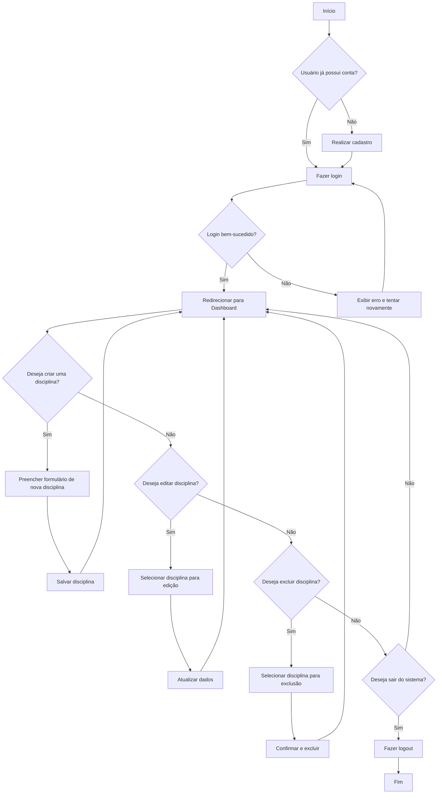

# Bem vindo à Akademika
## Do seu jeito, no seu ritmo.

Já pensou em estruturar seus estudos de forma eficaz e com o uso de IA? Com a Akademika, organizar seus estudos é mamão com açúcar. O app permite que qualquer estudante mantenha suas anotações, tópicos de estudo e datas importantes perfeitamente organizados, sem a necessidade de sistemas complexos ou montes de papéis. Com apenas alguns passos, você pode ficar despreocupado e focar no que realmente importa: aprender. além disso, nós trazemos uma funcionalidade única: Uma Ia totalmente ao seu dispor.

[Link do figma](https://www.figma.com/design/q9mR5Wp2TJW44F6dgbJxMd/Akademika?node-id=44-21&t=scNMNx8ve1yYBw8p-0)

[Link do Trello](https://trello.com/b/bSx1z2P8/akademika)
[Link da apresentação](https://www.canva.com/design/DAGpHsDjYZk/guk5QJ28E735uNUbMpuuAg/edit)
## Sobre o projeto

## Funcionalidades (1º release)

### Cadastro e login de usuários

Permite que os usuários acessem seus recursos de estudo de forma segura e prática, mantendo seu aprendizado garantido.

[Link do figma](https://www.figma.com/proto/q9mR5Wp2TJW44F6dgbJxMd/Akademika?node-id=218-394&p=f&t=c0IokIbE7aeIyFyC-0&scaling=min-zoom&content-scaling=fixed&page-id=0%3A1&starting-point-node-id=44%3A21)

[Link do Trello](https://trello.com/b/bSx1z2P8/akademika)

### Gerenciamento de disciplinas

As disciplinas são o fundamento da organização dos seus estudos na Akademika, o app permite que você crie as disciplinas para agrupar suas notas, atividades e outras informações importantes.

Você pode gerenciar as disciplinas com extrema facilidade, com uma interface limpa, simples e intuitiva.

[Link do figma](https://www.figma.com/proto/q9mR5Wp2TJW44F6dgbJxMd/Akademika?node-id=254-425&p=f&t=c0IokIbE7aeIyFyC-0&scaling=min-zoom&content-scaling=fixed&page-id=0%3A1&starting-point-node-id=44%3A21)

[Link do Trello](https://trello.com/b/bSx1z2P8/akademika)

## Perfil de Disciplina
O perfil de disciplina é responsável por mostrar ao usuário quais são as informações fornecidas daquela matéria,informando de forma rápida e prática acerca de dados, atividades e provas daquela disciplina.

[Link do figma](https://www.figma.com/proto/q9mR5Wp2TJW44F6dgbJxMd/Akademika?node-id=307-628&p=f&t=c0IokIbE7aeIyFyC-0&scaling=min-zoom&content-scaling=fixed&page-id=0%3A1&starting-point-node-id=44%3A21)

[Link do Trello](https://trello.com/b/bSx1z2P8/akademika)

## Diagrama de atividades

Pair programming: Não foi usado na maior parte dos nossos processos em razão do conflito de horários com os membros. Optamos por alinhamentos assíncronos na maior parte do desenvolvimento (O que se mostrou bem efetivo).

